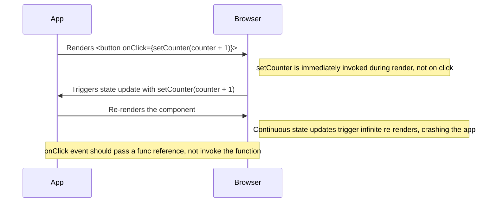

| Main Ideas                                | Notes                                                                                                                                                                                                                                                                                                                                                                                                                                                                                                                                                                                                                                                                                                                                                                                                                                                                                                                                                                                                                                                                                                                                                                                                                              |
| ----------------------------------------- | ---------------------------------------------------------------------------------------------------------------------------------------------------------------------------------------------------------------------------------------------------------------------------------------------------------------------------------------------------------------------------------------------------------------------------------------------------------------------------------------------------------------------------------------------------------------------------------------------------------------------------------------------------------------------------------------------------------------------------------------------------------------------------------------------------------------------------------------------------------------------------------------------------------------------------------------------------------------------------------------------------------------------------------------------------------------------------------------------------------------------------------------------------------------------------------------------------------------------------------- |
| Component                                 | The reusable UI elements of the app<br><br>A JavaScript function that returns a single JSX element<br><br>Names always begin with a capital letter<br>                                                                                                                                                                                                                                                                                                                                                                                                                                                                                                                                                                                                                                                                                                                                                                                                                                                                                                                                                                                                                                                                             |
| ECMAScript 6 / ES6                        | Newer version of JS released in 2015<br><br>Introduced let, const, arrow functions, For/of, object and array destructuring                                                                                                                                                                                                                                                                                                                                                                                                                                                                                                                                                                                                                                                                                                                                                                                                                                                                                                                                                                                                                                                                                                         |
| JSX                                       | A syntax extension for JavaScript that allows you to write code that looks like HTML inside JavaScript files<br><br>In older web dev, HTML and JS were often kept in separate files. Ad web pages have become more interactive, it has become useful to keep logic and markup together in components<br><br>Easy to embed dynamic content                                                                                                                                                                                                                                                                                                                                                                                                                                                                                                                                                                                                                                                                                                                                                                                                                                                                                          |
| Babel                                     | A JavaScript compiler <br><br>Makes newer ES6 backwards compatible in current and older browsers<br><br>Polyfills missing features in your environment                                                                                                                                                                                                                                                                                                                                                                                                                                                                                                                                                                                                                                                                                                                                                                                                                                                                                                                                                                                                                                                                             |
| XML                                       | Extensible Markup Language<br><br>Similar to HTML but no predefined tags to use - You must create own tags for your needs<br><br>Way to store data for sharing and searching<br><br>Standardised format so easily shared and parsed<br><br>Used to separate data from presentation - does not carry info on how to be displayed<br><br>A complement to HTML - used to store and transport data where HTML is used to format and display the same data<br><br>Example<br>![[XML example.png]]                                                                                                                                                                                                                                                                                                                                                                                                                                                                                                                                                                                                                                                                                                                                       |
| Root component                            | A strong convention is a root component called App at the top of the component tree of the application, although it is not always the actual root as it can be wrapped in a utility component<br><br><br>It usually needs to contain one root element. Technically it could be an array of components but this is not a wise thing to do.<br><br>Can wrap in a fragment to avoid extra div in the DOM tree<br>                                                                                                                                                                                                                                                                                                                                                                                                                                                                                                                                                                                                                                                                                                                                                                                                                     |
| Props                                     | Used to pass data between React components<br><br>Every parent component can pass data to child components using props<br><br>The props' values can be "hardcoded" strings or results of JS expressions  <br><br>Like HTML attributes but you can pass any JS value  including objects, arrays and functions<br><br>Example<br><br>![[passing props.png]]<br><br>![[passing props result.png]]                                                                                                                                                                                                                                                                                                                                                                                                                                                                                                                                                                                                                                                                                                                                                                                                                                     |
| Do not render objects                     | Instead React will render primitive values such as strings or numbers<br><br>This will **not** work:<br><br>`const App = () => {`<br>  `const friends = [`<br>    `{ name: 'Peter', age: 4 },`<br>    `{ name: 'Maya', age: 10 },`<br>  `]`<br><br>  `return (`<br>    `<div>`<br>      `<p>{friends[0]}</p>`<br>      `<p>{friends[1]}</p>`<br>    `</div>`<br>  `)`<br>`}`<br><br>`export default App`<br><br>This will work:<br><br>`const App = () => {`<br>  `const friends = [`<br>    `{ name: 'Peter', age: 4 },`<br>    `{ name: 'Maya', age: 10 },`<br>  `]`<br><br>  `return (`<br>    `<div>`<br>      `<p>{friends[0].name} {friends[0].age}</p>`<br>      `<p>{friends[1].name} {friends[1].age}</p>`<br>    `</div>`<br>  `)`<br>`}export default App`<br><br><br>                                                                                                                                                                                                                                                                                                                                                                                                                                                  |
| JavaScript / ECMAScript updates           | Updates each year<br><br>Browsers don't support all of the newest features so code run in browsers is transpiled to older, compatible forms of JS<br>                                                                                                                                                                                                                                                                                                                                                                                                                                                                                                                                                                                                                                                                                                                                                                                                                                                                                                                                                                                                                                                                              |
| Node.js                                   | A JS runtime environment based on Google's Chrome V8 JS engine<br><br>A runtime environment is a platform or ecosystem where an app is executed. It provides the necessary services and resources needed for the app to run eg. memory allocation, input output handling and system calls.  <br><br>Code is written in JS files and run by typing `node filename.js`<br><br>Can run JS code in node console by typing `node` in command line<br><br>It’s asynchronous and event-driven so good for non-blocking network applications - to can handle multiple tasks without waiting for each to complete<br>                                                                                                                                                                                                                                                                                                                                                                                                                                                                                                                                                                                                                       |
| Object methods and `this`                 | React now has React Hooks so we don't need to define objects with methods<br><br>Arrow functions and functions defined using function keywork behave very differently with respect to the keyword `this`<br><br>Arrow functions don't work for methods for objects<br><br><br>Example:<br>`const arto = {`<br>  `name: 'Arto Hellas',`<br>  `age: 35,`<br>  `education: 'PhD',`<br><br>  `greet: function() {`<br>    `console.log('hello, my name is ' + this.name)`<br>  `},`<br>`}`<br><br>`arto.greet()  // "hello, my name is Arto Hellas" gets printed`<br><br><br>If we try and call this method reference referenceToGreet we will have a problem as the reference has lost the original reference to what `this` is, and the value of `this` becomes the global object (global variables and functions that are available throughout your program):<br><br>`arto.greet()       // "hello, my name is Arto Hellas" gets printed`<br><br>`const referenceToGreet = arto.greet`<br>`referenceToGreet() // prints "hello, my name is undefined"`<br>                                                                                                                                                                          |
| Using `this` with callback functions      | Another way we can lose track of `this` if we set a callback function to call the `greet` function on the `arto` object, using the setTimeout function - in this case it is the JS engine that actually calls the method, and by this point, `this` refers to the global object<br><br>We can prevent this in different ways including using a method called bind<br><br>`setTimeout(arto.greet.bind(arto), 1000)`<br><br>This creates a new function where `this` is bound to `arto` regardless of how the method is called<br><br>Arrow functions can prevent some of the problems with `this`<br>                                                                                                                                                                                                                                                                                                                                                                                                                                                                                                                                                                                                                               |
| Classes                                   | No class mechanism in JS like the ones in object-orientated prog languages<br><br>Class syntax was introduced into JS with ES6 which simplifies the definitions of classes (or class-like things)<br><br>Example:<br><br>class Person {<br>  constructor(name, age) {<br>    this.name = name<br>    this.age = age<br>  }<br>  greet() {<br>    console.log('hello, my name is ' + this.name)<br>  }<br>}<br>const adam = new Person('Adam Ondra', 29)<br>adam.greet()<br>const janja = new Person('Janja Garnbret', 23)<br>janja.greet()<br><br><br>The introduction of class syntax was controversial<br><br>React hooks are incompatible with JS class components because hooks are specifically designed to be used with functional components, which operate differently from class-based components.                                                                                                                                                                                                                                                                                                                                                                                                                        |
| Component helper functions                | A reusable function that encapsulates logic or behaviour to simplify or support the main component's rendering or state management<br><br>Defining a function inside another function like this is common in JS, unlike Java                                                                                                                                                                                                                                                                                                                                                                                                                                                                                                                                                                                                                                                                                                                                                                                                                                                                                                                                                                                                       |
| Destructuring                             | Added in ES6<br><br>Allows us to concisely extract values from arrays into distinct variables<br><br>The expression `const { name, age } = props` assigns the values 'Arto Hellas' to `name` and 35 to `age`<br><br>We can destructure props directly into variables like this:<br><br>const Hello = ({ name, age }) => {<br>const bornYear = () => new Date().getFullYear() - age<br><br>  return (<br>    \<div><br>      \<p><br>        Hello {name}, you are {age} years old<br>      \</p><br>      \<p>So you were probably born in {bornYear()}\</p><br>    \</div><br>  )<br>}<br><br>This saves the step of passing the entire props object in a variable called props then assigning properties after; we can do it by destructing the props that are passed to the component function as a paramter<br>                                                                                                                                                                                                                                                                                                                                                                                                                |
| Stateful components                       | The `useState` Hook adds state to the component<br><br>The function returns an array that contains two items; the item's state variable and a set function that allows you to update the state to a different value and triggers the component to re-render<br><br>Always use the set function and don't mutate state value directly as this can lead to problems<br>                                                                                                                                                                                                                                                                                                                                                                                                                                                                                                                                                                                                                                                                                                                                                                                                                                                              |
| Event handling                            | Event handlers are called when a specific event occurs<br><br>Button elements support mouse events and click is most common<br><br>This is how we register an event function handler to the click event<br><br>const App = () => {<br>  const \[ counter, setCounter ] = useState(0)<br><br><br>  const handleClick = () => {<br>    console.log('clicked')<br>  }<br><br>  return (<br>    \<div><br>      \<div>{counter}\</div><br>      \<button onClick={handleClick}><br>        \plus<br>      \</button><br>    \</div><br>  )<br>}<br><br>The button's onClick attribute is a reference to the handleClick function in the code<br><br>The event handler function can also bve defined directly in the value assignment of the onClick attribute ```<button onClick={() => setCounter(counter + 1)}>Click to add 1</button>```<br><br><br>This would **NOT** work:<br>`<button onClick={setCounter(counter + 1)}>`<br><br>See diagram below for explanation<br><br>Instead you do this:<br>`<button onClick={() => setCounter(counter + 1)}>plus</button>`<br><br>but is often better to separate the event handlers into separate functions and the value of the onClick attribute to be a reference to the function<br> |
| Spread syntax                             | `...originalObject, propertyToUpdate: 'new value'`<br><br>In effect this creates a new object that has all the properties of the original object, and if you specify a specific property you can update it                                                                                                                                                                                                                                                                                                                                                                                                                                                                                                                                                                                                                                                                                                                                                                                                                                                                                                                                                                                                                         |
| `join` method                             | creates and returns a new string by concatenating the elements of an array and separating by commas or a given separator string<br><br>**Example:**<br><br>const elements = \['Fire', 'Air', 'Water'];<br><br>console.log(elements.join());<br>// Expected output: "Fire,Air,Water"<br><br><br>console.log(elements.join('-'));<br>// Expected output: "Fire-Air-Water"                                                                                                                                                                                                                                                                                                                                                                                                                                                                                                                                                                                                                                                                                                                                                                                                                                                            |
| Update of state is asynchronous           | State update happens asynchronously in React<br><br>It doesn't happen immediately but at some point before the component is rendered again.<br><br>**This will cause a problem:**<br><br>const handleLeftClick = () => {<br>    setAll(allClicks.concat('L'))<br>    setLeft(left + 1)<br>    ***setTotal(left + right)  }***<br><br><br>**and this will fix it:**<br><br>const App = () => {<br>  // ...<br>  const handleLeftClick = () => {<br>    setAll(allClicks.concat('L'))<br>    ***const updatedLeft = left + 1***<br>    setLeft(updatedLeft)<br>    ***setTotal(updatedLeft + right)*** <br>  }<br><br>  // ...<br>}                                                                                                                                                                                                                                                                                                                                                                                                                                                                                                                                                                                                  |
| Conditional rendering                     | React offers many ways of doing conditional rendering<br><br>Can render completely different elements depending on the state of the application                                                                                                                                                                                                                                                                                                                                                                                                                                                                                                                                                                                                                                                                                                                                                                                                                                                                                                                                                                                                                                                                                    |
| Old React                                 | Before 16.8.0, there was no way too add state to functional components - you had to make class components using the JavaScript class syntax<br><br>Need to learn class syntax for dealing with legacy code<br><br>                                                                                                                                                                                                                                                                                                                                                                                                                                                                                                                                                                                                                                                                                                                                                                                                                                                                                                                                                                                                                 |
| Debugging React apps                      | React is a developer-friendly library for debugging<br><br>Keep webpage and console open together always. If code fails to compile, fix immediately<br><br>**Printing**<br>Use old school print-based debugging - if not working as expected, start printing out variables<br><br>**Debugger**<br>Chrome console's debugger<br>Can pause execution of code anywhere by writing debugger in code. Can they go to console and inspect current state of variables, before removing debugger and refreshing when fixed<br><br>**React dev tools in Chrome**<br>Allow you to inspect the different React elements along with their state and props<br>                                                                                                                                                                                                                                                                                                                                                                                                                                                                                                                                                                                  |
| Rules of Hooks                            | Must be called from within the function body that defines a React component<br><br>useState and useEffect must not be called from within a loop, conditional expression or place that is not a function defining a component                                                                                                                                                                                                                                                                                                                                                                                                                                                                                                                                                                                                                                                                                                                                                                                                                                                                                                                                                                                                       |
| Event handlers revisited                  | Don't set onClick action as a function call or any immediate function invocation<br><br>Do like this:<br>```js<br>onClick={() => setValue(0)}<br>```<br><br>or this:<br><br>  const handleClick = () =><br>    console.log('clicked the button')<br>...<br> \<button onClick={handleClick}>button\</button><br><br><br>Its generally best to define them in a separate place as in the second example where the the handleClick variable is assigned to a reference to the function                                                                                                                                                                                                                                                                                                                                                                                                                                                                                                                                                                                                                                                                                                                                                |
| A function that returns a function        | Can use this as a way to pass arguments to functions although this is not the only way<br><br>**Example**<br>const App = () => {<br>  const \[value, setValue] = useState(10)<br><br>  const hello = (who) => {<br>    const handler = () => {<br>      console.log('hello', who)<br>    }<br>    return handler<br>  }<br><br>  return (<br>    \<div><br>      {value}<br><br>      \<button onClick={hello('world')}>button</button><br>      \<button onClick={hello('react')}>button\</button><br>      \<button onClick={hello('function')}>button\</button><br>    \</div><br>  )<br>}<br><br>In this example the return value 'handler' is assigned to the onClick attribute<br><br>**This can be written like this:**<br><br>const hello = (who) => {<br>  const handler = () => {<br>    console.log('hello', who)<br>  }<br><br>  return handler<br>}<br><br><br>**or like this:**<br><br>const hello = (who) => () => {<br>  console.log('hello', who)<br>}                                                                                                                                                                                                                                                            |
| Don't define components within components | This causes lots of problems<br><br>One of these is that React treats a component inside a component as a new component in every render, and so can't be optimised by React                                                                                                                                                                                                                                                                                                                                                                                                                                                                                                                                                                                                                                                                                                                                                                                                                                                                                                                                                                                                                                                        |

**Why Immediate Function Invocation in React Event Handlers Can Break the App**
Example: `<button onClick={setCounter(counter + 1)}>`




### Summary
