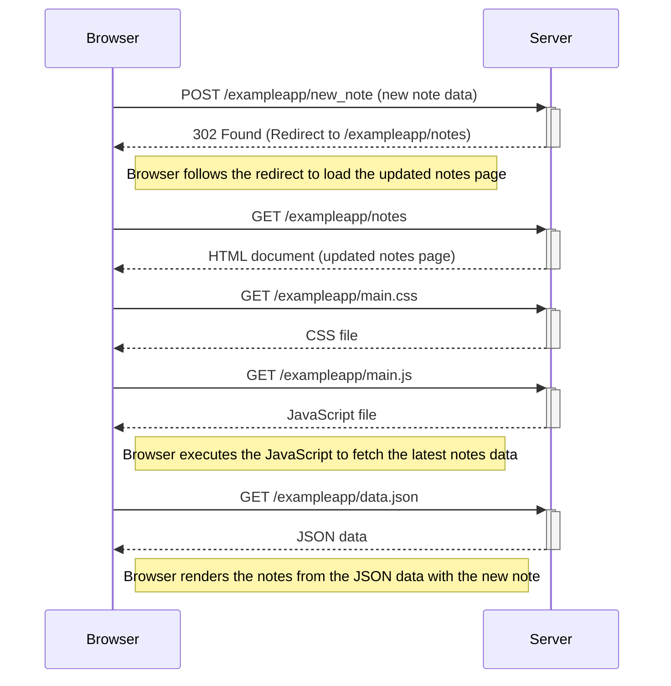

```mermaid
sequenceDiagram

participant Browser

participant Server

  

Browser->>+Server: POST /exampleapp/new_note (new note data)

activate Server

Server-->>-Browser: 302 Found (Redirect to /exampleapp/notes)

deactivate Server

  

Note right of Browser: Browser follows the redirect to load the updated notes page

  

Browser->>+Server: GET /exampleapp/notes

activate Server

Server-->>-Browser: HTML document (updated notes page)

deactivate Server

  

Browser->>+Server: GET /exampleapp/main.css

activate Server

Server-->>-Browser: CSS file

deactivate Server

  

Browser->>+Server: GET /exampleapp/main.js

activate Server

Server-->>-Browser: JavaScript file

deactivate Server

  

Note right of Browser: Browser executes the JavaScript to fetch the latest notes data

  

Browser->>+Server: GET /exampleapp/data.json

activate Server

Server-->>-Browser: JSON data

deactivate Server

  

Note right of Browser: Browser renders the notes from the JSON data with the new note
```
