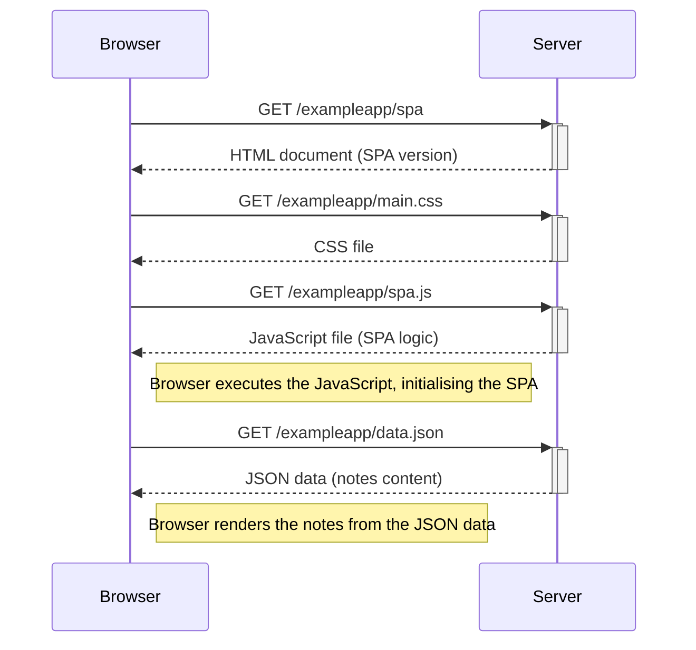

```mermaid
sequenceDiagram

participant Browser

participant Server

  

Browser->>+Server: GET /exampleapp/spa

activate Server

Server-->>-Browser: HTML document (SPA version)

deactivate Server

  

Browser->>+Server: GET /exampleapp/main.css

activate Server

Server-->>-Browser: CSS file

deactivate Server

  

Browser->>+Server: GET /exampleapp/spa.js

activate Server

Server-->>-Browser: JavaScript file (SPA logic)

deactivate Server

  

Note right of Browser: Browser executes the JavaScript, initialising the SPA

  

Browser->>+Server: GET /exampleapp/data.json

activate Server

Server-->>-Browser: JSON data (notes content)

deactivate Server

  

Note right of Browser: Browser renders the notes from the JSON data
```