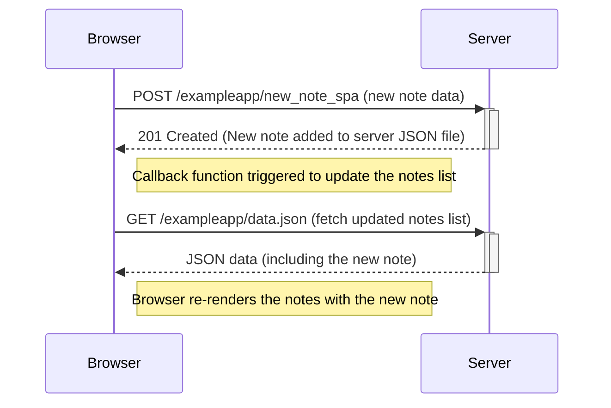

```mermaid
sequenceDiagram

participant Browser

participant Server

  

Browser->>+Server: POST /exampleapp/new_note_spa (new note data)

activate Server

Server-->>-Browser: 201 Created (New note added to server JSON file)

deactivate Server

  

Note right of Browser: Callback function triggered to update the notes list

  

Browser->>+Server: GET /exampleapp/data.json (fetch updated notes list)

activate Server

Server-->>-Browser: JSON data (including the new note)

deactivate Server

  

Note right of Browser: Browser re-renders the notes with the new note
```